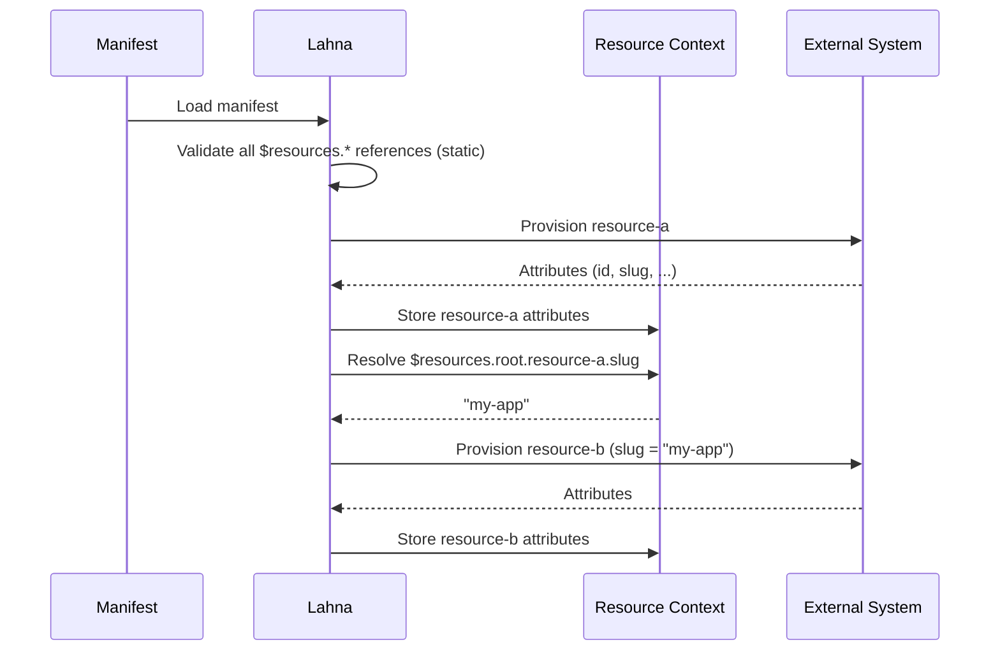

# Context and Context References

When Lahna provisions resources, each resource produces a set of **attributes** — outputs that become available once provisioning completes (e.g. an ID assigned by an external system, a generated URL, a slug).

Context references let you use those output attributes as input parameters for other resources in the same manifest, creating an explicit dependency chain.

## Reference syntax

```text
$resources.<scope>.<resource_id>.<attribute>
```

| Segment       | Description                                              |
|---------------|----------------------------------------------------------|
| `$resources`  | Context type. Currently the only supported type          |
| `scope`       | The provisioning scope the referenced resource belongs to|
| `resource_id` | The `resource_id` from the manifest                      |
| `attribute`   | The output attribute name                                |

### Example

```text
$resources.root.git-project.external_id
```

This resolves to the `external_id` attribute produced by the `git-project` resource in the `root` scope.

## How resolution works

References are resolved at provisioning time, after the referenced resource has been created:

1. Lahna provisions resources in dependency order.
2. Once a resource is created, its output attributes are stored in the **resource context**.
3. Before provisioning a resource that contains references, Lahna substitutes each `$resources.*` token with the actual value.

If a referenced resource has not yet been provisioned, or the attribute does not exist, provisioning fails with a descriptive error.



## Validation

Lahna validates all context references when the manifest is loaded, before any provisioning begins:

- The context type must be `resources`.
- The scope must exist.
- The `resource_id` must exist within that scope.
- The `attribute` must be a declared output attribute of the resource kind.

This means manifest errors are caught early, not mid-provisioning.

## Available resource attributes

Each resource kind declares its output attributes. See the [Resources](/category/resources) section for the full reference.

## Usage example

```yaml
resources:
  - resource_id: backend-repo
    kind: GitProject
    parameters:
      project_name: my-app-backend

  - resource_id: deploy-key
    kind: DeployKey
    parameters:
      # Use the slug of the repository created above
      repository_slug: $resources.root.backend-repo.slug
```

When `deploy-key` is provisioned, `$resources.root.backend-repo.slug` is replaced with the actual slug produced by `backend-repo`.
